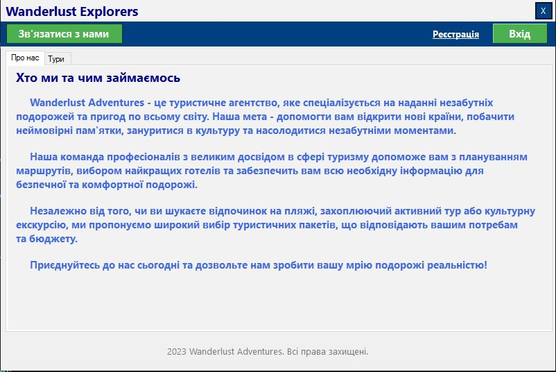
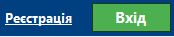
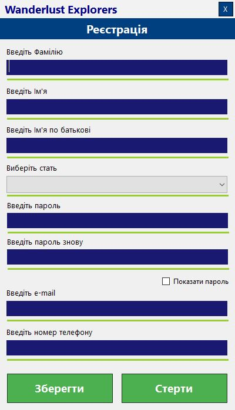
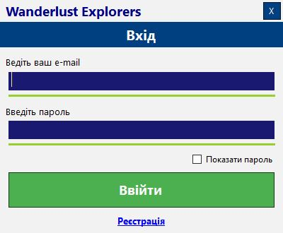
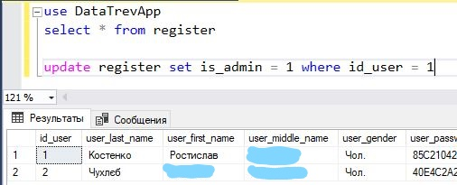

# A little help after starting the program
## Procedure
You will see the **main form** after starting the program. 




### Registration
First you will need to **'register'** (hyperlink on the left).


Then the registration form will open.



Follow the rules of filling in the fields:
- for Names (first name, last name and middle name from top to bottom) only letters of the alphabet;
- then select Gender (drop-down list);
- enter Password and Repeat below (English alphabet only, minimum one capital letter, minimum one small letter, minimum one number, minimum 8 characters, special characters are possible: @#$%^&*);
- enter your valid e-mail address (confirmation codes and messages will be sent to it);
- enter your phone number according to your regional standard.

Then you can **'Save'** your account (**Left button**, right button - Clear all textboxes).

After registering, **log in** to your account (**Right button**). 


### Log in


Enter your email and password here, then click on the green **'Log in'** button.


### Create the first administrator
If we want to create and edit tours we need to **create the first administrator**. To do this, go to **Microsoft SQL Server Management Studio 18**. 



**Query code**:
1. first run this part of the query to **find out the id** of the user you want to make an administrator:
```
use DataTrevApp
select * from register
```
2. then do this part to **give the selected user administrator status** (in my case it is user with id - 1):
```
update register set is_admin = 1 where id_user = 1
```

**You can now return to the program in the login**


### After authorization of the administrator
This is how the form should look like after **administrator** authorization.

.JPG)

You can now **create tours** when you click on '**+**'  and **edit** them (after clicking on the tour). You can also now **administer** other users in the corresponding 'Accounts' tab after the 'Tours' tab.


### View of the main form for a regular user (guest too)
This is how the form should look like for regular user or guest:

.JPG)

Here you can search, browse and book tours. You can also view the booked tours and cancel them in your drop-down list.


**Enjoy using and exploring the program!**
